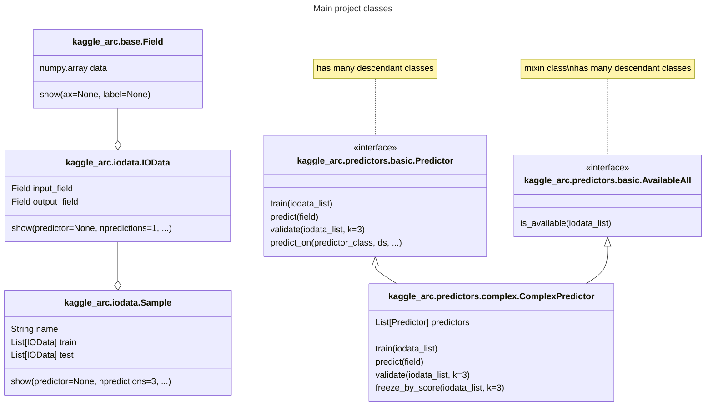

# Description

Legacy code with my solutions from https://www.kaggle.com/c/abstraction-and-reasoning-challenge. 

I'm refactoring it to reuse in the ongoing kaggle ARC Prize competition.

It is not guaranteed that there are no typos or missing code pieces. If you use this, use at your own risk, especially predictor classes which use xgboost (I've noticed that they crash kaggle notebook on some data samples, but haven't figured out how to fix).

## Installation & usage
```bash
git clone https://github.com/latticetower/kaggle-arc.git kaggle-arc
pip install kaggle-arc
```


